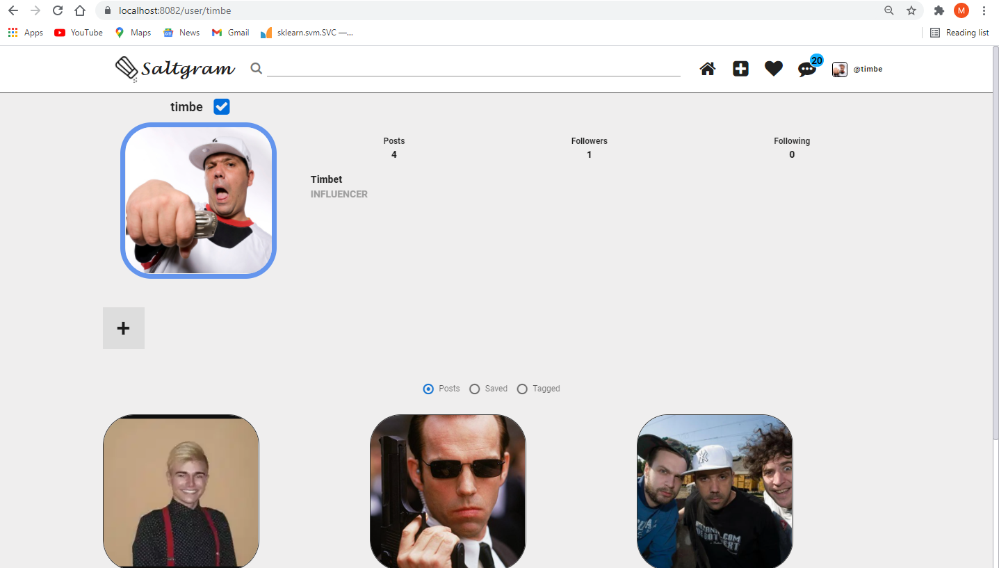
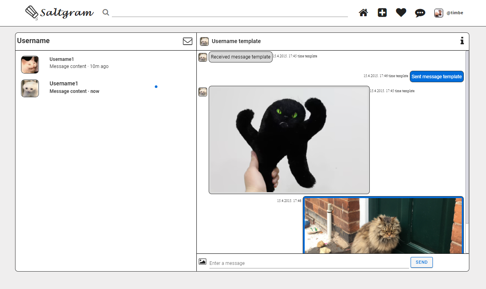
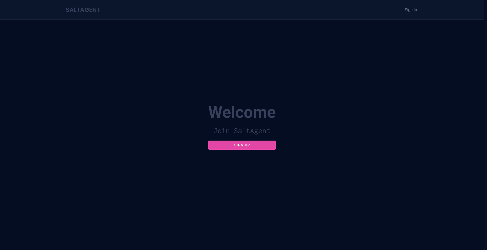

# SaltGram 
Image and video sharing social network platform for  
XML and WEB Services course

## Technologies used
The frontend's done as a Single Page Application written in [VueJs](https://vuejs.org/) served via small web server using default golang libraries.

The backend's written in [Golang](https://golang.org/) using mostly default libraries and [gorilla mux](https://github.com/gorilla/mux) following the microservice design pattern.

Security-wise the app supports 2FA, RBAC, salted password hashing (hence the name), reCAPTCHA v3 and it has it's own Public Key Infrastructre which handles certificates for HTTPS and such.

## Features
Contains all the basic features such as messaging, following, content reporting, etc.

## Agent app
On top of basic social networking features, there's an Agent app (WIP) where agents can manage their products and ads.

## Members

| Member | Student No.|
| ------ | ---------- |
| Pekez Marko | RA18/2017 |
| Farkaš Kristian | RA7/2017 |
| Knežević Milan | RA9/2017 |
| Ivošević Jovan | RA30/2017 |
